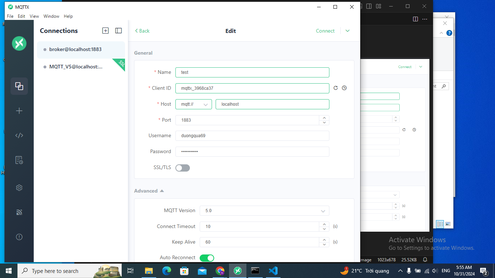

## Bố trí thí nghiệm 
- sử dụng mosquito tạo 1 broker trên máy cá nhân (PC)

- Sử dung MQTT client tạo 1 client kết nối đến broker mosquito đã tạo ở cổng 1883

- tạo chứng chỉ và khóa cho bảo mật TLS bằng openssl

- Sử dụng MQTT client tạo 1 client kết nối đến broker mosquito đã tạo ở cổng 8883 với các chứng chỉ đã tạo

## Kịch bản thí nghiệm

-Sau khi kết nối gửi 1 vài tin nhắn đến các topic trên các cổng bảo mật kiểm tra xem có nhận được không

## Kết quả

**Hình 3**

- **Hình 3** cho thấy: các tin nhắn được gửi và nhận ở cổng 1883 bình thường

**Hình 4**

- **Hình 4** cho thấy: các tin nhắn được gửi và nhận ở cổng 8883 bình thường

