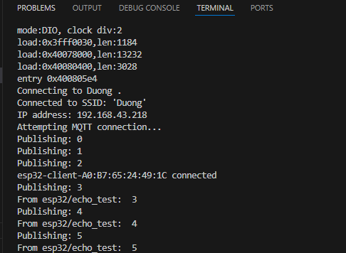
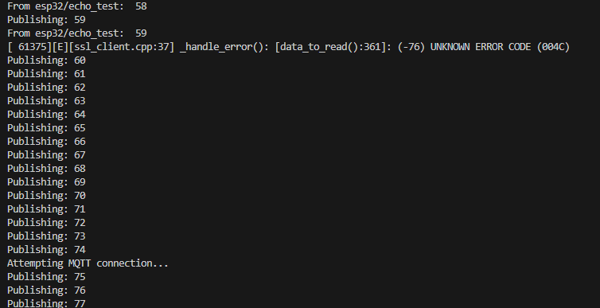
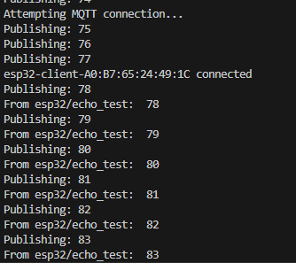
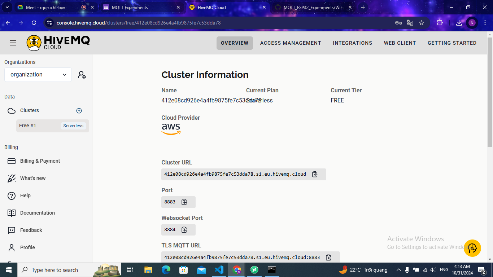
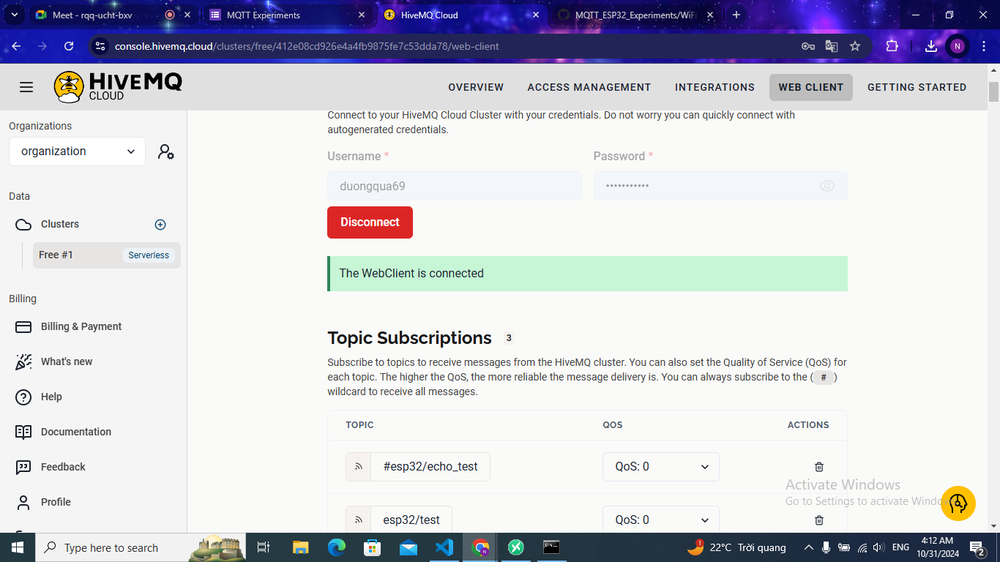
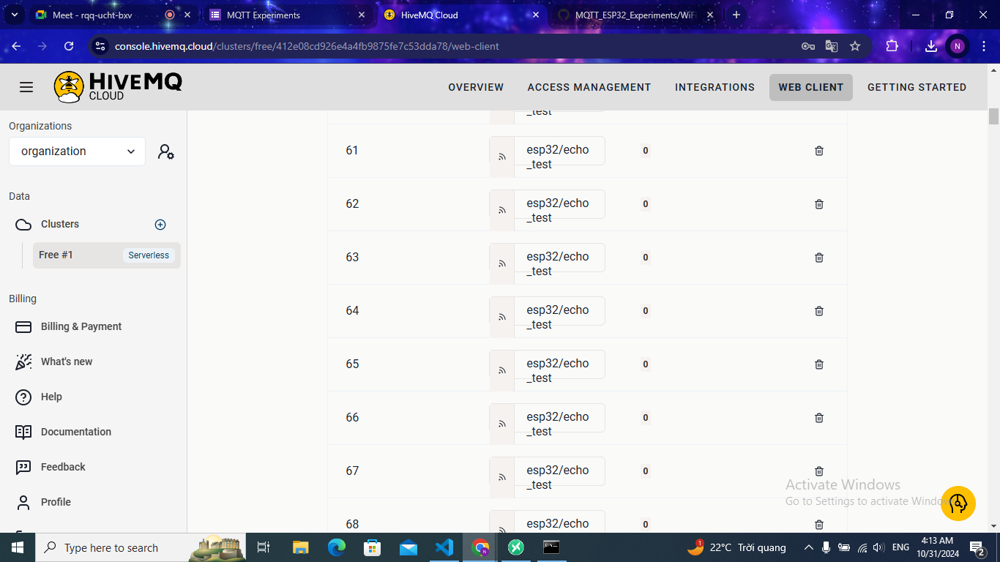

## Kịch bản thí nghiệm

- Sau khi ESP32 khởi động, sẽ kết nối WiFi vào một điểm phát AP đã định (ssid, và pass trong secrets/wifi.h) --> thành công
- Sẽ thấy MQTT Client kết nối đến broker thành công và bắt đầu gửi (publish) và nhận (subscribe) số đếm tăng dần trong `echo_topic` đều đặn
- Khi đó sẽ tiến hành ngắt điểm phát WiFi, tiện nhất là phát wifi từ điện thoại để bật ngắt nó nhanh chóng trong tầm tay
- Quan sát phản ứng của MQTT Client trong mã khi mất kết nối WiFi giữa chừng, 
- sau đó bật lại điểm phát WiFi và quan sát khả năng khôi phục kết nối, và quan sát việc mất gói tin trong quá trình kết nối.

## Kết quả
Quan sát thông điệp in ra theo thời gian ta thấy một vài điều thú vị ngoài dự kiến như sau:

**Hình 1**

1. Thư viện PubSubClient có thể gọi hàm publish trước khi thiết lập kết nối thành công với broker
- **Hình 1** cho thấy: có ba thông điệp được "publish" là 0, 1, 2 trước cả khi MQTT kết nối thành công
- Sau khi kết nối WiFi thành công, thì `Attempting MQTT connection...` mất khoảng 3s để thiết lập kết nối (mỗi lần publish là 1s).

**Hình 2**

2. Khi ngắt điểm phát WiFi (AP):
- **Hình 2** ngắt tín hiệu từ bộ phát WiFi - ví dụ: trên điện thoại, giữa chừng khi ESP32 đang publish thông điệp 59 (xem hình 2).
- Ngay lập tức ssl_client ở lớp dưới trên con ESP32 báo lỗi (ssl_client.cpp:37 ...)
- Sau đó thì thư viện PubSubClient vẫn tiếp tục publishing thông điệp 1s mỗi lần, từ 60 tới 74 (đúng 15s).
- 15s sau thì MQTT Client mới phát hiện ra việc mất kết nối MQTT.

**Hình 3**

- Như trên **Hình 3** việc kết nối MQTT khôi phục mất khoảng 3s sau khi kết nối WiFi khôi phục (không in thông điệp kết nối WiFi connected do logic của mã thí nghiệm). 

- Tạo broker bằng HiveMQ.

-Kết nối đến broker.

-Giao  tiếp qua broker.